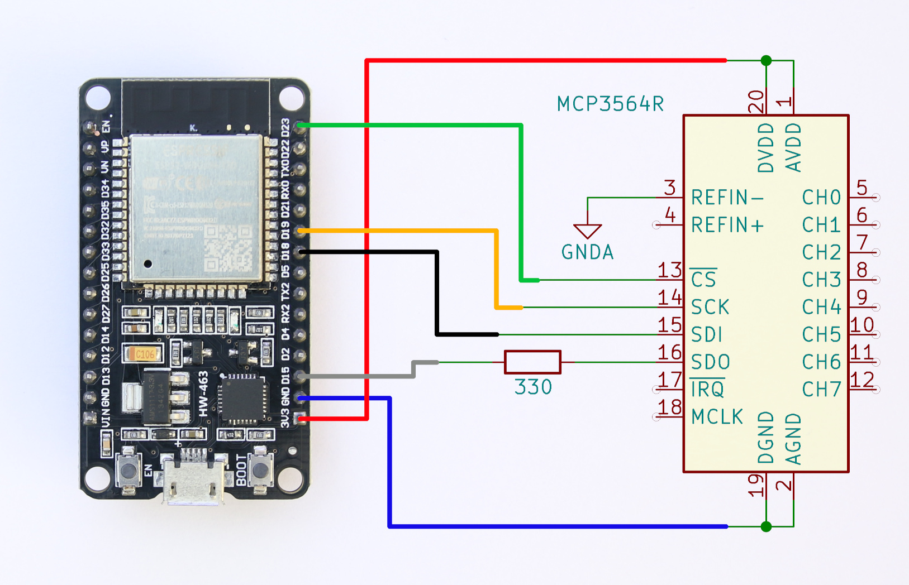
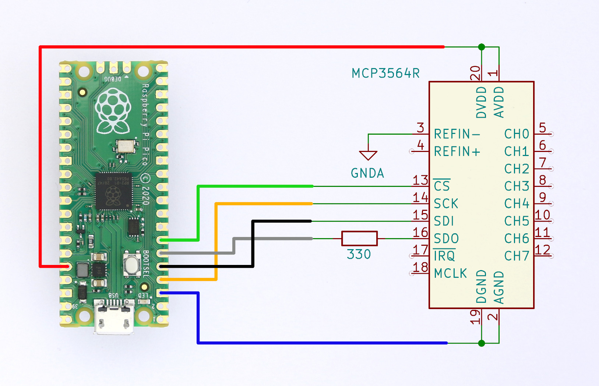

### Test circuit for use with the examples.

The circuit uses ESP32-WROOM-32D on NodeMCU-ESP32 and MCP3564R.

With additional IRQ connection

Using RP Pico.

Expected result - measurement using an internal temperature sensor

Expected result – in scan mode

